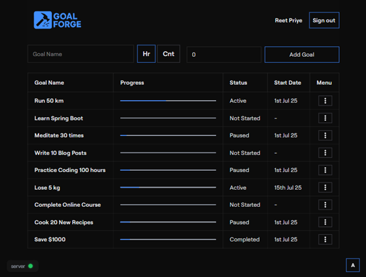

# Goal Forge → Shape and build your goals step by step
### Keep watching efforts on a calendar for easier tracking

## How to Use the App

### 1. Check Server Status
- **Green:** The server is ready.
- **Red:** Wait until it turns green before proceeding.
- ⚠️ You cannot sign in while the server is red.
- ℹ️ This happens because the app is hosted on Render’s free tier, which puts the server to sleep when inactive. It may take a short time to wake up.

### 2. Sign In (Optional)
You can use the app without signing in, but your goals will only be saved locally.

To save goals to the cloud and sync across devices:
1. Click "Sign in with Google".
2. If you already have local goals, you’ll get these options:
   - **Append** – Add your local goals to your account.
   - **Reset** – Replace local goals with your server goals.
   - **Skip Import** – Ignore local goals and continue with your account goals.

### 3. Add a New Goal
1. Enter your goal’s name.
2. Select the type:
   - **Hr:** Track by hours (e.g., "Study 20 hours").
   - **Cnt:** Track by count (e.g., "Read 10 books").
3. Enter the estimated effort (e.g., 20 hours or 10 books).
4. Click "Add Goal".

The new goal will appear with the status **"Not Started"**.

### 4. Manage Goals
Open the menu (three dots) next to a goal to:
- **Start** – Begin tracking progress.
- **Pause** – Temporarily stop tracking.
- **Resume** – Continue tracking after pausing.
- **Complete** – Mark the goal as finished.
- **Delete** – Remove the goal permanently.

### 5. Log Progress
- Click on a goal to log your daily progress.
- Enter how much you’ve completed.
- The progress bar will update automatically.
- **You cannot log for previous days.** This has been kept because we want users to keep checking this app daily, so that it helps them to be on track.

### 6. Personalize the App
- Use the color switcher in the bottom-right corner to change the app’s accent color.

---

There are tons of goal tracking apps. But the motive of this app is to keep it minimalistic and have only required functions.